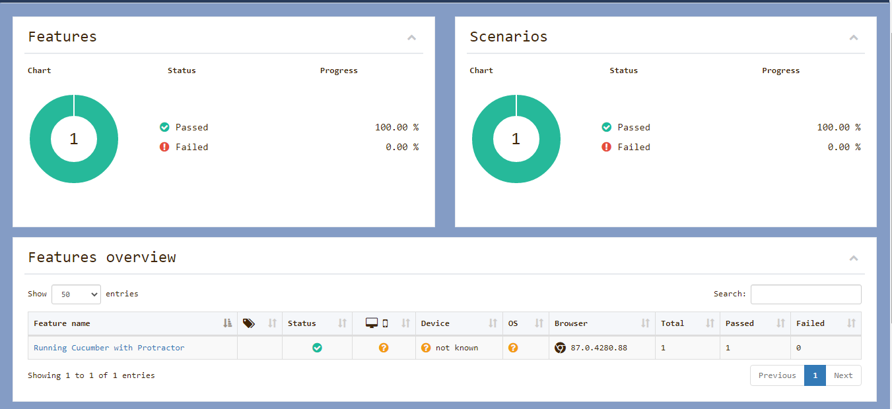
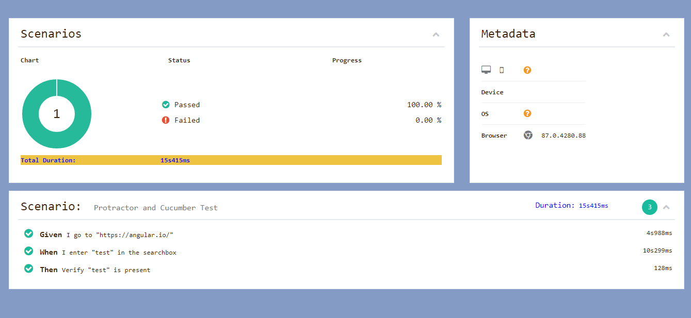

**Install as global (npm install -g "module"):**
* NodeJS
* Protractor (this also installs WebDriverManager)

**Install other node_modules inside project root (npm install --save-dev "module"):**
* protractor-cucumber-framework
* Cucumber
* Chai
* protractor-simple-cucumber-html-reporter-plugin
* And other required node modules

**Update WebDriverManager:**
* WebDriver-Manager update

**Start Selenium Server:**
* WebDriver-Manager start

**Run Tests:**
* protractor protractor.conf.js

**Report:**

  
  

